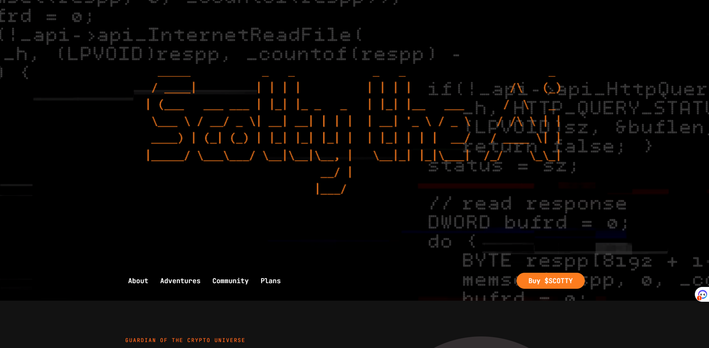

# The Backend of ScottyTheAI

## Live site

## Contact info

- **Email:** mr.new0509@gmail.com
- **Telegram:** [@mrnew0509](https://t.me/mrnew0509)
- **Skype:** [@sin085](https://join.skype.com/invite/xat3AgpiRVOI)

## Release date

Jun 24, 2023

## Last updated at

Jun 24, 2023

## Environment

- `Node.js v18.16.0`

## Stack

- **Framework:** `Express.js v4.18.2`
- **Database:** `MySQL v8.0.27-winx64`

## How to run the project.

1. Please open terminal window in the root directory.
2. Please run command `npm run dev` in it.
